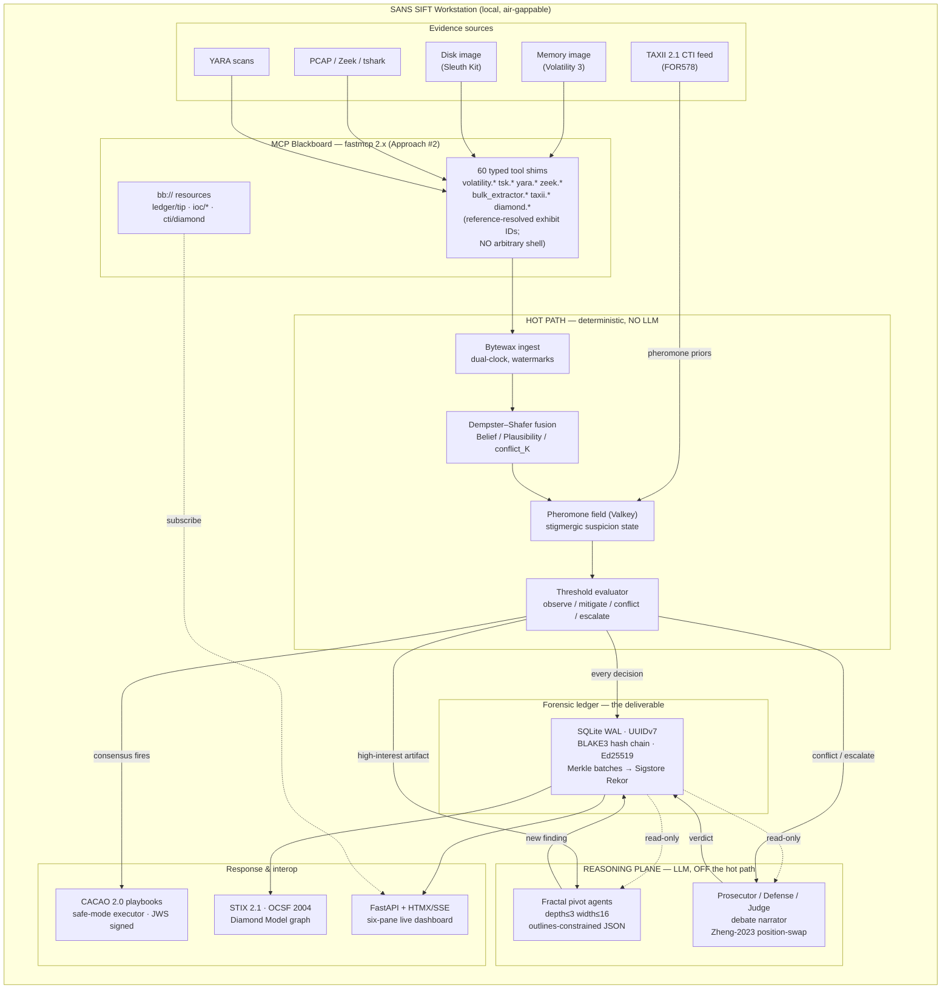
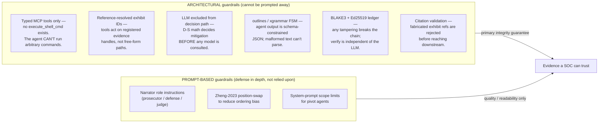

# FIND EVIL — Architecture Diagram (Deliverable 3)

**Architectural pattern:** *Custom MCP Server (Approach #2)* from the Find Evil!
brief — typed, schema-validated MCP tools instead of `execute_shell_cmd`, with
server-side output parsing before anything reaches the LLM. The brief calls this
"the most sound architecture in the evaluation… also the most work." FIND EVIL
has done that work.

The single most important property: **the LLM is never in the containment
decision path.** Deterministic Dempster–Shafer fusion decides; the ledger
records; only then does the LLM explain. Hallucination cannot cause a wrong
mitigation because the LLM has no authority to mitigate.

---

## System overview

---

## Guardrails: architectural vs prompt-based

The brief specifically asks submissions to **distinguish prompt-based guardrails
from architectural guardrails.** This is FIND EVIL's strongest differentiator.

**The line that matters:** if every prompt-based control failed simultaneously —
the model ignored every instruction — FIND EVIL would still produce a correct,
signed, tamper-evident decision, because the decision was never the model's to
make. Prompt guardrails here improve *explanation quality*, not *evidence
integrity*.

---

## How this maps to the 4 supported approaches

| Approach | What it is | FIND EVIL |
|---|---|---|
| #1 Prompt-only | Tell the model to be careful | rejected — not enforceable |
| **#2 Custom MCP Server** | **Typed tools, server-side parsing, ref-resolved IDs** | **this is FIND EVIL** |
| #3 Wrapper/proxy | Filter an `execute_shell_cmd` server | weaker than #2 |
| #4 Fine-tune | Train a bespoke model | out of scope for local DFIR |

## Relationship to Protocol SIFT

Protocol SIFT is a **Claude Code skill-file + permissions configuration** for a
SIFT workstation (behavioral rules, `settings.json` allow-lists, a `Stop` audit
hook). It is *prompt-and-permission* tuning of a general agent. FIND EVIL is a
**standalone Custom MCP Server** that runs **alongside** Protocol SIFT: a judge
can point any MCP-capable agent (Claude Code included) at FIND EVIL's blackboard
on `127.0.0.1:9310/mcp` and get deterministic fusion + a signed ledger that
Protocol SIFT's skill layer does not itself provide. The two are complementary —
Protocol SIFT shapes *how the agent thinks*; FIND EVIL constrains *what the
agent can do and proves what it did.* See [try-it-out.md](try-it-out.md).
